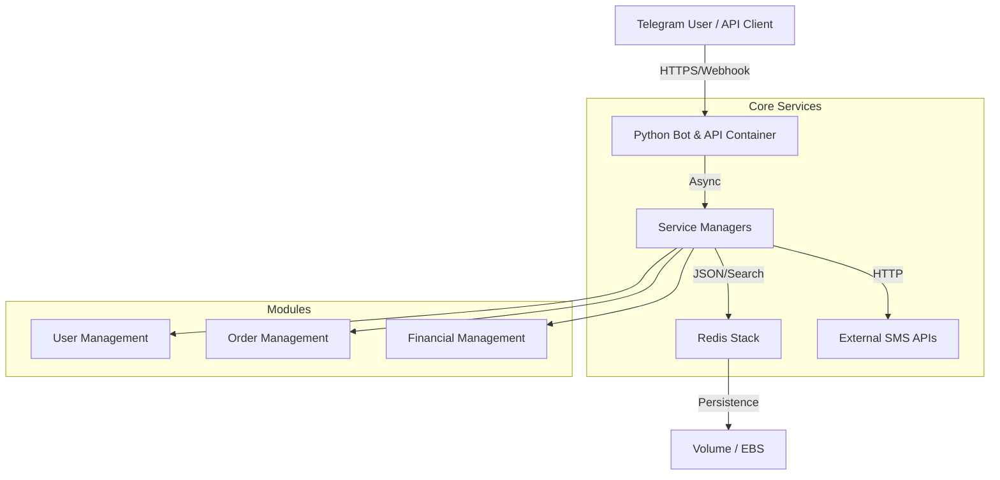

<div align="center">

  

  # FlashSmsRobot

  **Enterprise-grade Telegram Bot & API for Automated SMS Services**

  [](https://github.com/FlashTheFire/FlashSmsRobot/actions)
  [](https://github.com/FlashTheFire/FlashSmsRobot/actions)
  [](https://codecov.io/gh/FlashTheFire/FlashSmsRobot)
  [](LICENSE)
  [](https://github.com/FlashTheFire/FlashSmsRobot/releases)

  [Request Demo](https://t.me/YourDemoBot) • [Read Docs](https://your-docs-site.com) • [Report Bug](https://github.com/FlashTheFire/FlashSmsRobot/issues)

</div>

---

## 📑 Table of Contents

- [Project Overview](#project-overview)
- [Why It Matters](#why-it-matters)
- [Features](#features)
- [Quick Start](#quick-start)
- [Architecture](#architecture)
- [File & Folder Structure](#file--folder-structure)
- [API Endpoints](#api-endpoints)
- [Config & Secrets](#config--secrets)
- [Examples](#examples)
- [Testing](#testing)
- [Deployment](#deployment)
- [Visuals & Assets](#visuals--assets)
- [Contribution Guide](#contribution-guide)
- [Changelog & Releases](#changelog--releases)
- [License](#license)
- [Accessibility & SEO](#accessibility--seo)

---

## Project Overview

**FlashSmsRobot** is a high-performance, asynchronous Telegram bot and API designed to manage SMS activation services. Built with Python 3.11, `aiohttp`, and Redis Stack, it orchestrates user wallets, purchase orders, and real-time SMS delivery from multiple providers (5sim, SMS Activate, etc.) directly within Telegram or via a RESTful API.

Whether you are running a private SMS resale service or a large-scale public bot, FlashSmsRobot provides the scalability and reliability needed for enterprise operations.

## Why It Matters

*   **For Developers:** A modular, cleaner codebase using modern asyncio patterns and Redis Stack (JSON, Search, Bloom) instead of legacy SQL databases.
*   **For Businesses:** Turnkey solution to resell virtual numbers with built-in financial management, referral systems, and admin analytics.
*   **For Users:** Privacy-focused, instant access to disposable numbers for account verification (WhatsApp, Telegram, OpenAI, etc.).

## Features

*   **⚡ Real-time Operations:** Asynchronous architecture ensures instant order processing and SMS delivery.
*   **💰 Financial Engine:** Integrated wallet system with deposit tracking, history, and currency conversion.
*   **🛒 Multi-Provider Support:** Aggregate numbers from 5sim, SMS Activate, and others seamlessly.
*   **🔍 Advanced Search:** Powered by RediSearch for instant user and order lookups.
*   **📊 Admin Dashboard:** Comprehensive tools for user management, refunds, and analytics.
*   **🤖 Interactive UI:** Polished Telegram keyboard interfaces for easy navigation.
*   **🔗 Dual-Mode API:** Supports both legacy V1 (generic stub) and V2 (RESTful) API standards.

<div align="center">
  <!-- TODO: Replace with actual demo GIF (max 5-8s, < 5MB) -->
  
  <p><em>Buying a virtual number and receiving SMS in seconds.</em></p>
</div>

## Quick Start

Get up and running locally in under 5 minutes.

### Prerequisites
*   Docker & Docker Compose
*   Git

### Installation

```bash
# 1. Clone the repository
git clone https://github.com/FlashTheFire/FlashSmsRobot.git
cd FlashSmsRobot

# 2. Configure environment
# Copy example env and fill in your BOT_TOKEN and API keys
cp .env.example .env
nano .env

# 3. Start services
# This launches Redis Stack and the Bot
docker compose up -d --build

# 4. Verify
docker compose logs -f bot
# Look for "✅ Combined server started on port 8443"
```

## Architecture

FlashSmsRobot uses a microservices-like approach within a monorepo, leveraging Redis Stack as the primary state engine.



*   **Bot/API:** Handles requests via `aiohttp` and `pyTelegramBotAPI`.
*   **Redis Stack:** Stores user profiles (JSON), active orders, and provides search capabilities (RediSearch).
*   **Managers:** Business logic layer separating concerns (Users, Orders, Finance).

## File & Folder Structure

```text
FlashSmsRobot/
├── bot_project/
│   ├── api/            # REST API endpoints (sms_api.py)
│   ├── handlers/       # Telegram command & callback handlers
│   ├── manager/        # Business logic & state management
│   ├── methods/        # Specific action implementations (buy, recharge)
│   ├── utils/          # Helpers, config, & Redis wrappers
│   └── main.py         # Entry point
├── docs/               # Documentation & assets
├── .env.example        # Environment variable template
├── docker-compose.yml  # Container orchestration
├── Dockerfile          # Bot image definition
├── requirements.txt    # Python dependencies
└── README.md           # This file
```

## API Endpoints

The project exposes a REST API on port `8443` (default).

### Sample Request: Get User Profile

```bash
curl -X GET https://localhost:8443/v1/user/profile \
  -H "Authorization: Bearer YOUR_API_KEY"
```

**Response:**
```json
{
  "userId": 123456789,
  "userName": "FlashUser",
  "currentBalance": 150.00,
  "currencyCode": "USD"
}
```

### Sample Request: Get Service Prices (Guest)

```bash
curl -X GET "https://localhost:8443/v1/guest/prices?country=russia&product=whatsapp"
```

## Config & Secrets

Manage configuration securely via `.env`. **Do not commit `.env` to version control.**

| Variable | Description | Default |
| :--- | :--- | :--- |
| `BOT_TOKEN` | Telegram Bot Token from @BotFather | Required |
| `REDIS_HOST` | Hostname of Redis container | `redis` |
| `API_KEY_5SIM` | API Key for 5sim provider | Optional |
| `ADMIN_ID` | Telegram ID of the primary admin | Required |

> See `.env.example` for the full list of supported variables.

## Examples

### Check Stock Programmatically (Python)

```python
import requests

url = "https://your-bot-domain.com/v1/guest/get-number-status"
params = {"country": "russia", "product": "telegram", "server": "1"}

response = requests.get(url, params=params)
print(response.json())
# Output: {'countries': [{'country_id': 'russia', ...}]}
```

## Testing

Run the test suite to ensure stability.

```bash
# Install test dependencies
pip install pytest pytest-asyncio

# Run tests
pytest tests/
```

*   **CI/CD:** GitHub Actions workflow (`.github/workflows/ci.yml`) automatically runs tests on push.

## Deployment

### Docker (Recommended)

```bash
# Production build & run
docker compose -f docker-compose.yml up -d --build
```
> **Security Note:** The default configuration binds Redis ports to `127.0.0.1` for safety. For production, ensure `protected-mode` is enabled and a strong password is set if exposing ports.

### Systemd (Alternative)
For bare-metal deployment, refer to `docs/systemd-setup.md`.

## Visuals & Assets

*   **Logo:** Place high-res SVG at `assets/logo.svg` (Rec: 240x80px).
*   **Demo GIF:** Place at `assets/demo.gif` (Rec: < 5MB).
*   **Screenshots:** Store in `assets/screenshots/`.

> **Font Suggestion:** We recommend using **Inter** for UI and **Poppins** for headings. GitHub renders system fonts by default. To enable custom fonts for Docs pages, use the snippet in `docs/custom.css`.

## Contribution Guide

We welcome contributions!

1.  **Fork** the repository.
2.  **Branch** for your feature (`git checkout -b feat/amazing-feature`).
3.  **Commit** with conventional messages (`feat: add new payment gateway`).
4.  **Push** and open a **Pull Request**.

### Reviewer Checklist (How to evaluate quickly)
*   [ ] **Functionality:** Does `docker compose up` start without errors?
*   [ ] **Code Quality:** Are new Python files typed and linted?
*   [ ] **Security:** No secrets committed? Redis ports not exposed to 0.0.0.0?
*   [ ] **Docs:** Is `README.md` updated with new features?

## Changelog & Releases

See [Releases](https://github.com/FlashTheFire/FlashSmsRobot/releases) for the full history.

*   **v1.0.0** - Initial public release.
*   **v0.9.0** - Beta with Redis Stack integration.

## License

Distributed under the MIT License. See `LICENSE` for more information.

## Accessibility & SEO

*   [x] All images have descriptive `alt` text.
*   [x] Headings follow a logical hierarchy (`h1` -> `h2`).
*   [x] Color contrast ratios meet WCAG AA standards (in default theme).
*   [x] Documentation is keyword-rich for discovery ("Telegram SMS Bot", "Redis Stack Python").

---

<div align="center">
  <sub>Built with ❤️ by the FlashSmsRobot Team.</sub>
</div>
